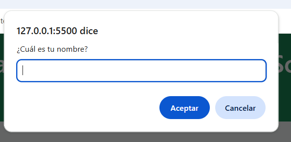
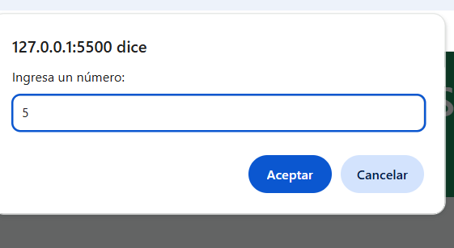

# Proyecto Modulo #4: Aplicacion de consola en JavaScript.

Este proyecto corresponde a la Evaluación del modulo #4 del curso: DESARROLLO DE APLICACIONES FRONT-END TRAINEE

La aplicación se ejecuta en la consola del navergador y permite practicar los conceptos basicos del lenguaje de programación aprendido en este modulo. 

## Objetivo de la Evaluación.
Desarrollar una app en consola que permita:
- Realizar operaciones matematicas (suma, resta, multiplicación y división)
-Implementar estructuras condicionales y bucles.
- Modularizar el codigo usando funciones.
- Trabajar con arreglos y Objetos.

## Estructura del proyecto 
PROYECTO-M4/
├── index.html
├── README.md
├── js/
│   └── app.js
└── img/
├── nombre.png
├── nombre (2).png
├── saludo-alexandra.png
├── ingrese-un-numero1.png
├── ingrese-un-numero2.png
├── queOperacionhacer.png
├── resultado.png
├── filtradoporLetra.png
├── filtrado.png
└── objetoEstudiantes.png

## 📸 Capturas de pantalla

### Saludo inicial

         (img/nombre (2).png)
         (img/saludo,alexandra.png)
         

### Operaciones matemáticas

              (img/ingrese-un-numero2.png)
              (img/queOperacionhacer.png)
              (img/resultado.png)

### Filtrado de frutas

         (img/filtrado.png)

### Objetos y arreglos

---

## ⚙️ Requisitos
- Navegador web (Chrome, Edge, Firefox).
- Visual Studio Code (opcional, para editar el código).

---

## 🚀 Cómo ejecutar
1. Clona o descarga el proyecto.
2. Abre el archivo `index.html` en tu navegador.
3. Presiona **F12** y ve a la pestaña **Consola**.
4. Interactúa con la aplicación:
   - Ingresa tu nombre.
   - Ingresa dos números para realizar operaciones.
   - Filtra frutas por letra.
   - Observa cómo funcionan las funciones y los objetos.

---

## 📸 Ejemplo de uso
- Al iniciar, la aplicación te pedirá tu nombre y mostrará un saludo.
- Luego solicitará dos números y mostrará operaciones matemáticas.
- Podrás filtrar frutas por letra.
- Finalmente, verás cómo se usan objetos y arreglos de objetos.

---

## ✅ Funcionalidades implementadas
- **Operaciones matemáticas** con funciones.
- **Condicionales** (`if`, `else`, `switch`).
- **Bucles** (`for`, `while`).
- **Arreglos** y filtrado con `.filter()`.
- **Funciones** que llaman a otras funciones.
- **Objetos** con propiedades y métodos.
- **Arreglo de objetos** recorrido con `.forEach()` y `.map()`.